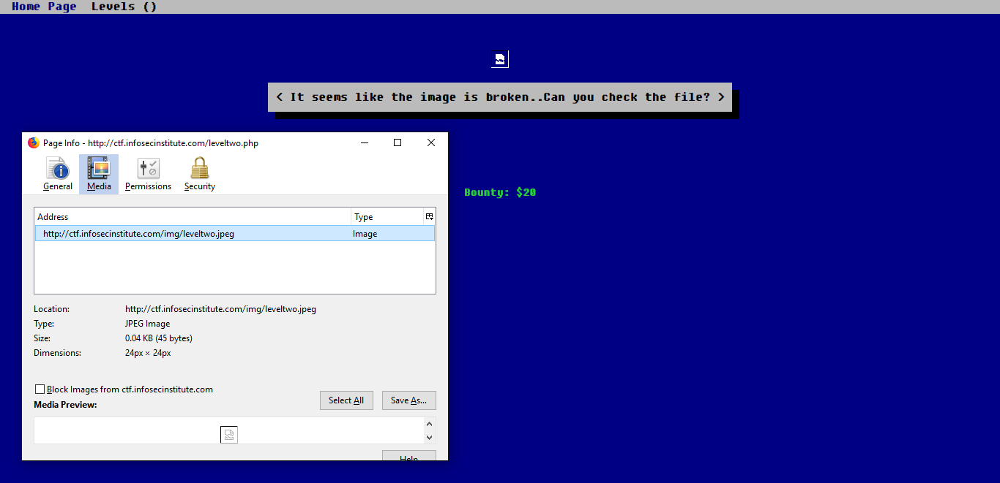
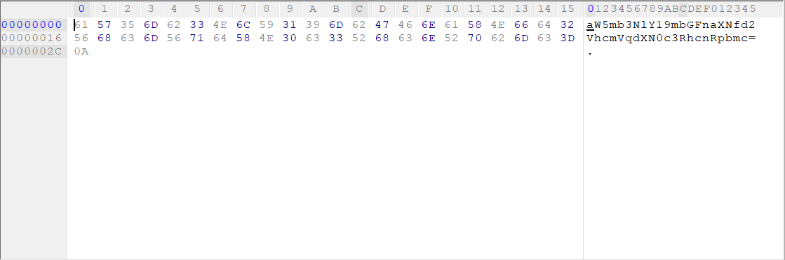
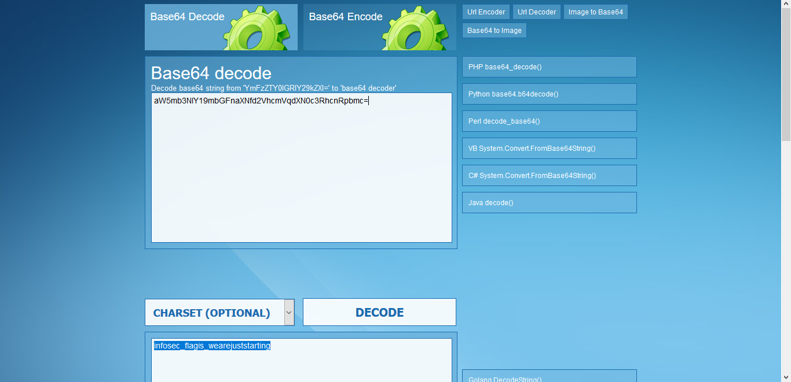
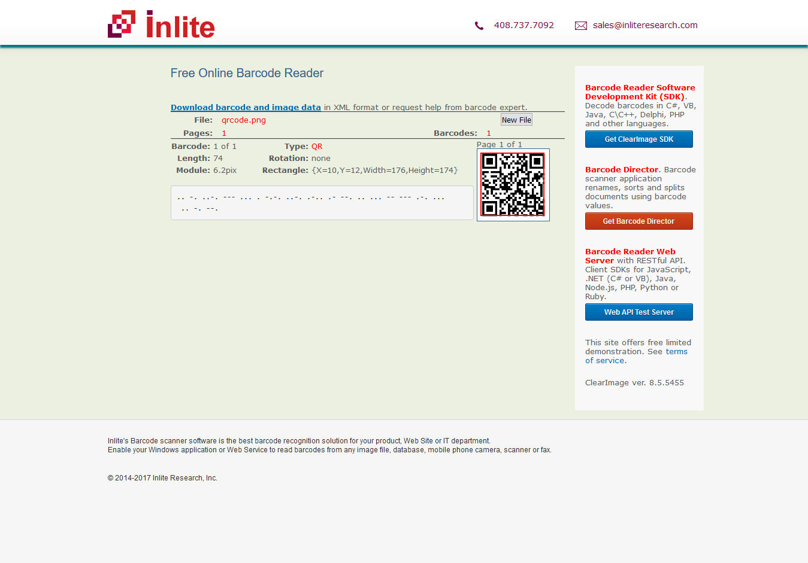
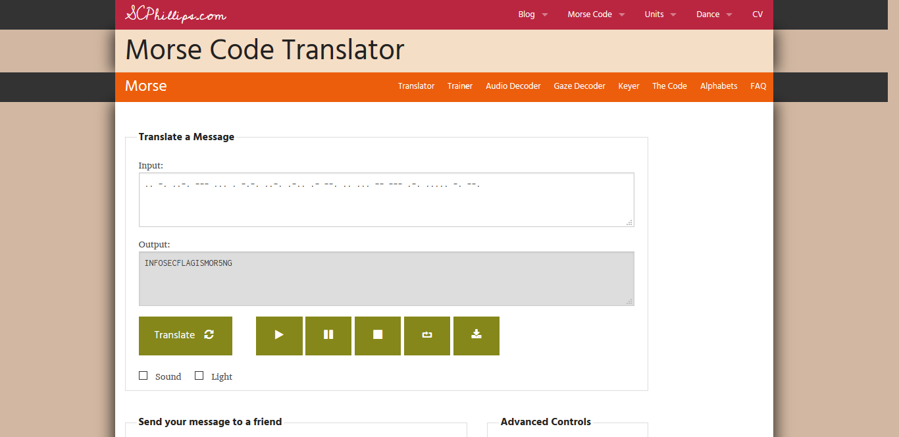
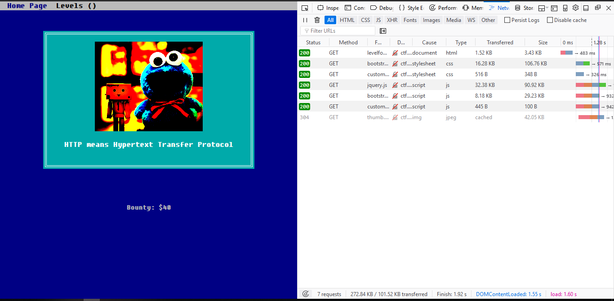
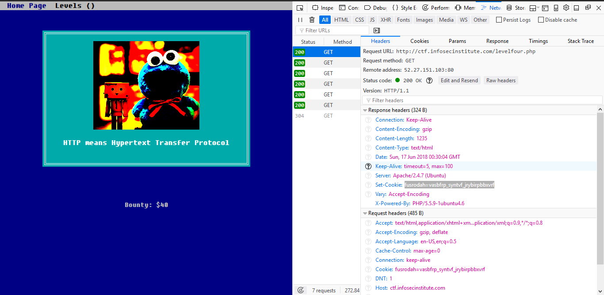
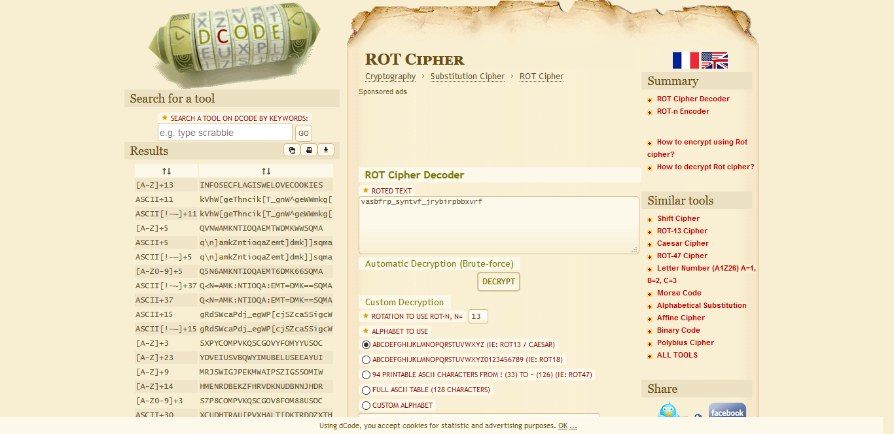

# Noob CTF Labs Writeup 
 ---
 Lets get started
 ### [CTF1](http://ctf.infosecinstitute.com/levelone.php)
 So the first CTF is just looking at the source code of the site (hinted by the pun on the page). 
 
 The source of the site shows "infosec_flagis_welcome" as the flag.
 
  ### [CTF2](http://ctf.infosecinstitute.com/leveltwo.php)
  The second CTF has a broken image file that we have to check. Save the file and open the file in a hex editor. 
   
   Looks like we have a base64 string. So go to www.base64decode.net or decode it in terminal, whatever suits you best, and we have the second flag.
   
   The base64 string decodes to be "infosec_flagis_wearejuststarting"
                                                                          
 ### [CTF3](http://ctf.infosecinstitute.com/levelthree.php)
 On the third CTF we land on a page with a qrcode and a loading bar. First we save the qrcode so we can read what it decodes to(do you decode qr files?). I used online-barcode-reader.inliteresearch.com to read the qrcode. Use whatever method suits you.
 
 So the qrcode decodes to ".. -. ..-. --- ... . -.-. ..-. .-.. .- --. .. ... -- --- .-. ..... -. --." which looks like morse code. I decoded the morse code with morsecode.scphillips.com/translator.html?utm_source=hootsuite 
 
 The morse code decode into "INFOSECFLAGISMOR5NG"
  
 ### [CTF4](http://ctf.infosecinstitute.com/levelfour.php)
 In the forth CFT we get the hint of HTTP. Firefox has a builtin Network Monitor so we press F12 and chose the networkmonitor then reload the page and a few entries come up.
 
 Lets have a look at one of these GET Requests 
 
 There seems to be a cookie called fusrodah and the text is just seemingly random. 
 We know we're looking for a flag with the format of "infosec_flagis_something". The cookie has the same amount of letters so lets try to decode it. I used https://www.dcode.fr/rot-cipher to automaticly decode the text as it looked like a rot cypher as we know it has the same fromat as our flag.
 
 The flag is "INFOSECFLAGISWELOVECOOKIES"