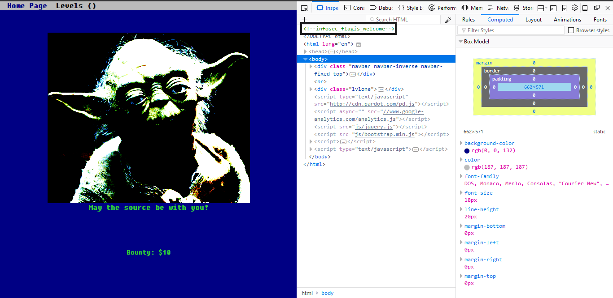

# Noob CTF Labs Writeup 
 ---
 Lets get started
 ### CTF1
 So the first CTF is just looking at the source code of the site (hinted by the pun on the page). 
 
 infosec_flagis_welcome is the flag
 
  ### CTF2
  The second CTF has a broken image file that we have to check. Save the file and open the file in a hex editor. 
   
   Looks like we have a base64 string. So go to www.base64decode.net or decode it in terminal, whatever suits you best, and we have the second flag.
   
   The base64 string decodes to be infosec_flagis_wearejuststarting
                                                                          
